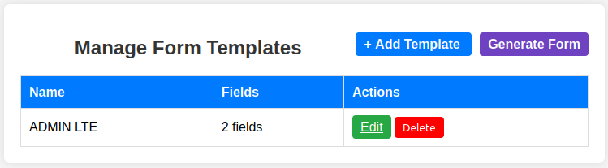
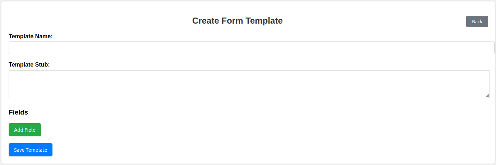
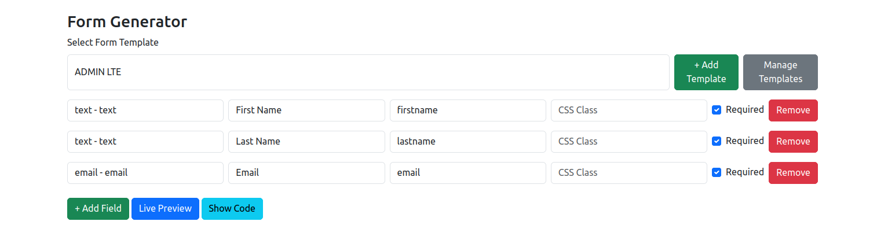
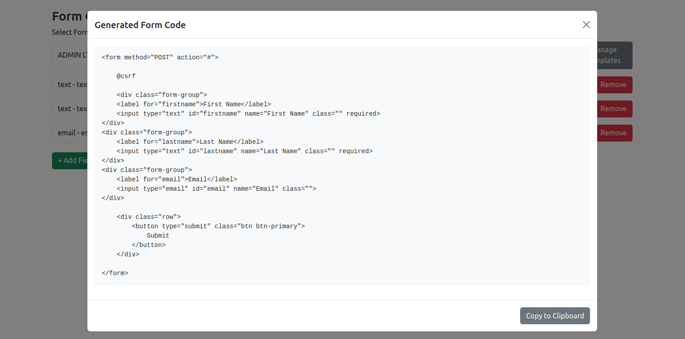

# Laravel Form Generator

A dynamic Laravel package for creating reusable form templates, generating forms using configurable field stubs, previewing forms in real time, and exporting the generated HTML code.

## Features

* Manage reusable form templates
* Define custom template stubs
* Create dynamic field definitions
* Support multiple field types
* Live form preview
* Generate HTML form code instantly
* Copy generated code to clipboard
* Bootstrap-based user interface
* Easy integration into Laravel applications
* Package auto-discovery support

---

## Supported Field Types

The package currently supports the following field types:

* Text
* Email
* Password
* Number
* Date
* Textarea
* Select
* Radio
* Checkbox
* File Upload
* Hidden
* Submit Button

Additional field types can easily be added using stub templates.

---

## Installation

Install the package via Composer:

```bash
composer require ganesh/form-generator
```

Publish package assets and migrations:

```bash
php artisan vendor:publish --provider="Ganesh\FormGenerator\FormGeneratorServiceProvider"
```

Run migrations:

```bash
php artisan migrate
```

---

## Accessing the Package

After installation, access the package using the following routes:

### Manage Templates

```
/form-generator/templates
```

### Generate Forms

```
/form-generator
```

---

## Workflow

The package follows a simple workflow:

### 1. Create a Form Template

Define a reusable form layout using a template stub.

Example:

```html
<form method="POST" action="#">
    @csrf

    [[FIELDS]]

    <button type="submit" class="btn btn-primary">
        Submit
    </button>
</form>
```

The placeholder `[[FIELDS]]` will be replaced with generated field HTML.

---

### 2. Define Available Fields

Configure field stubs such as:

Example Text Field:

```html
<div class="form-group">
    <label for="{{ $id }}">{{ $name }}</label>

    <input
        type="text"
        id="{{ $id }}"
        name="{{ $name }}"
        class="{{ $class }}"
        {{ $required }}>
</div>
```

Example Email Field:

```html
<div class="form-group">
    <label for="{{ $id }}">{{ $name }}</label>

    <input
        type="email"
        id="{{ $id }}"
        name="{{ $name }}"
        class="{{ $class }}"
        {{ $required }}>
</div>
```

---

### 3. Generate Forms

Select a template and configure fields by specifying:

* Field Type
* Field Label
* Field ID
* CSS Class
* Required Option

Preview the form instantly before exporting.

---

## Screenshots

### Manage Form Templates

Manage all created templates and perform edit/delete operations.



Features:

* View all templates
* See field count
* Edit templates
* Delete templates
* Navigate to form generation

---

### Create Form Template

Create reusable form layouts and define available field stubs.



Features:

* Template Name
* Template Stub Editor
* Dynamic Field Definitions
* Add Multiple Fields
* Save Templates

---

### Generate Form

Generate forms dynamically using existing templates.



Features:

* Select Template
* Add Fields
* Configure IDs and Classes
* Mark Fields as Required
* Remove Fields
* Live Preview
* Show Generated Code

---

### Generated Code

View and copy the generated HTML.



Features:

* Generated HTML Output
* Copy to Clipboard
* Template Stub Integration
* Field Placeholder Replacement

---

## Example Generated Output

```html
<form method="POST" action="#">

    @csrf

    <div class="form-group">
        <label for="firstname">First Name</label>

        <input
            type="text"
            id="firstname"
            name="First Name"
            class=""
            required>
    </div>

    <div class="form-group">
        <label for="lastname">Last Name</label>

        <input
            type="text"
            id="lastname"
            name="Last Name"
            class=""
            required>
    </div>

    <div class="form-group">
        <label for="email">Email</label>

        <input
            type="email"
            id="email"
            name="Email"
            class="">
    </div>

    <button type="submit" class="btn btn-primary">
        Submit
    </button>

</form>
```

---

## Extending the Package

You can create custom field types by adding new stubs.

Examples:

* Color Picker
* Range Slider
* Telephone Input
* URL Input
* DateTime Picker
* Multi-select Dropdown
* Custom Components

---

## Requirements

* PHP 7.3 or higher
* Laravel 8.x and above
* Bootstrap 5

---

## Contributing

Contributions are welcome.

Please fork the repository and submit a pull request for improvements or new features.

---

## License

This package is open-sourced software licensed under the MIT license.

---

## Author

**Ganesh Kumar**

Laravel Full Stack Developer

GitHub: https://github.com/Ganeshk007
Packagist: https://packagist.org/packages/ganeshk007/form-generator

